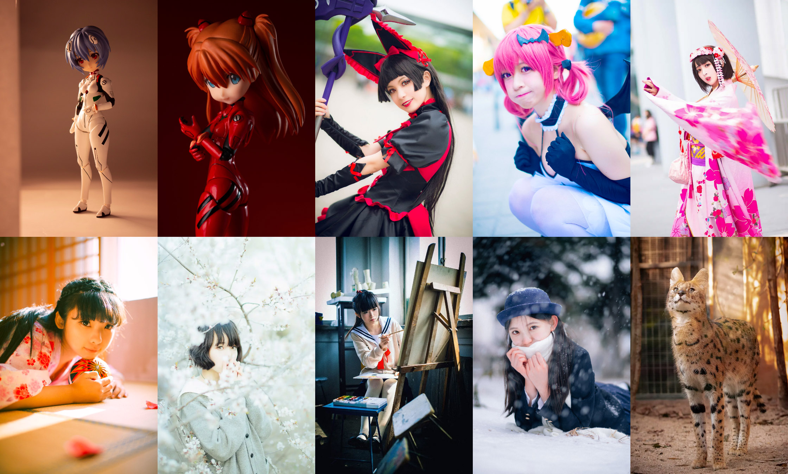

### (*´▽｀)ノノ✨✨

你好，我是卜卜口~

喜欢做有趣的项目、
喜欢人像拍摄、
喜欢圣地巡礼、
喜欢玩反恐精英、
喜欢自己捏粘土人头发。

有一个 [博客](https://mouto.org/) 、
社交媒体主要用 [微博](https://weibo.com/reiove)

喜欢「福音战士」 头像是自己模仿贞本义行原画拍的 [照片](https://weibo.com/1197780522/HnmkwpIPC) 

喜欢巡礼「吹响吧！上低音号」 [巡礼文章](https://www.bilibili.com/read/cv4791285) 被推荐过哔哩哔哩首页最大的轮播位四天，凑齐九张图会发一条 [微博](https://weibo.com/1197780522/Ipgkka7S3)

### 一些个人项目

[能不能好好说话](https://lab.magiconch.com/nbnhhsh/)、
[电子包浆](https://magiconch.com/patina/)、
[蒸 気 機](https://magiconch.com/vaporwave/)、
[恶臭数字论证器](https://lab.magiconch.com/homo/)、

[Sakana! 石蒜模拟器](https://lab.magiconch.com/sakana/)、

[One Last Image 卢浮宫生成器](https://lab.magiconch.com/one-last-image/)、
[福音战士标题生成器](https://lab.magiconch.com/eva-title/)、

[EVA 扫雷](https://v.magiconch.com/mine-sweeper)、
[MAGI System](https://lab.magiconch.com/magi/)、
[选择所有包含绫波丽的图片](https://lab.magiconch.com/captcha/rei)、

[梗图生成器](https://x.magiconch.com)、
[字符字生成器](https://magiconch.com/fontfont/)、
[粘土人列表](https://magiconch.com/nendoroids/)、
[你画我猜](https://v.magiconch.com/drawhat)、

[不会百度么？](https://buhuibaidu.me/)

还活着的项目最近会整理到 [神奇海螺实验室](https://lab.magiconch.com/)

<h3>一些巡礼图</h3>

<!-- 

 -->

<h3>一些粘土娃</h3>

<!-- 

  
  
  
  
  
  
  
  
  
  
  
  

 -->

<h3>一些...竖构图</h3>

<!-- 

  
  
  
  
  
  
  
  
  
  

 -->

<!--  -->

<!--  -->

<!--  -->

<!--   -->

